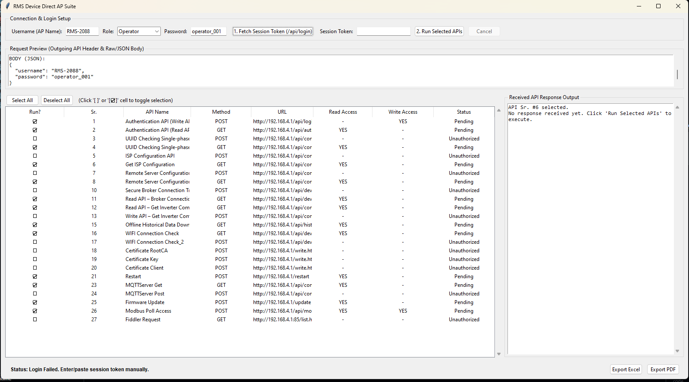

# RMS Device Direct Access Point (AP) testing Suite Pro (v10)

This is a comprehensive, production-grade diagnostic application written in Python using a modernized `Tkinter` dark theme GUI (`Catppuccin Mocha` themed). It facilitates sequential, step-by-step verification and configuration of RMS IoT Gateway units over their local direct Wi-Fi Access Point link (default gateway IP `192.168.4.1`).

---

## 📸 Interface Screenshots & References


---

## 🚀 Key Features

1. **Modern Dark/Slate Theme Interface**
   - Built using a high-contrast custom `ttk.Style` palette with a professional slate-dark scheme.
   - Alternating Treeview grid columns, active hover states, and clear, color-coded status badges (`🔴 Not Detected`, `🟡 Warning`, `🟢 Active`).
   - Supports system DPI scaling on Windows devices for high-resolution displays.

2. **Step-by-Step Gated Configuration Workflow**
   - Instead of running all checks randomly, the app provides a left-side sequential control panel mapping out a **6-Stage Configuration Pipeline**:
     1. **Detect AP**: Automatically verify Wi-Fi signal and gateway connection.
     2. **Obtain Token**: Authenticates role, grabs session cookie, and initiates a 60-second timer countdown.
     3. **Upload Credentials**: Writes Root CA Certificate (`rootCA.pem`), Private Key (`key.pem`), and Client Certificate (`client.pem`).
     4. **Write Settings**: Pushes cellular ISP details (APN values) and remote server routing coordinates.
     5. **Verify Broker**: Commands the gateway to hook into secure MQTT channels and checks link status telemetry.
     6. **Reboot**: Performs a software restart cycle on the gateway.
   - **Validation Gates**: Attempting to execute stages without completing previous prerequisites (like writing parameters without an active token) will launch user notifications explaining the missing dependencies.

3. **Automatic Wi-Fi Discovery (Background Daemon)**
   - Utilizes Windows `netsh` APIs running in a background threat loop to detect available Wi-Fi networks every 5 seconds.
   - Finds networks starting with `RMS-` and populates them into a dropdown selection box.
   - Automatically determines if the user is connected to a valid device, showing live link connection banners in real time.

4. **Right-Hand Collapsible Info & Diagnostics Panel**
   - **📚 API Reference Tab**: Displays endpoint-specific JSON structures, required permissions, and functional documentation for the API row currently highlighted in the master grid.
   - **🔑 Certificates Vault Tab**: Centralizes view and copy access for the embedded Root CA, Client Cert, and Private Key PEM files.
   - **📡 Ping Diagnostics Tab**: Loops background ping command prompts to `192.168.4.1`, measuring response times and compiling packet health diagnostics.

5. **Multi-Format Export & Reports**
   - Instantly compiles execution telemetry into formatted **PDF summary sheets** (via ReportLab) and detailed **Excel spreadsheets** (via OpenPyXL) showing response bodies, HTTP status codes, and access permissions.

---

## 🛠️ Installation & Setup

Ensure Python 3.8+ is installed on your local computer, then install the dependencies listed in `requirements.txt`:

```bash
pip install -r requirements.txt
```

### Run the Application

```bash
python Session_testing_10.py
```

---

## 🔒 Role Permission Matrix Reference

The application simulates 4 levels of system privileges configured on the gateway:

| Role Name | Access Privilege Level / Permissions | Default Password |
| :--- | :--- | :--- |
| **Viewer** | Read-Only data visualization endpoints. Cannot modify parameters. | `viewer_001` |
| **Operator** | Read & limited write (e.g. Modbus scheduler access). | `operator_001` |
| **System Admin** | Core hardware configurations (UUID checks, inverter link speeds). | `sysadmin_001` |
| **Security Admin** | Ultimate write operations (Certificate uploads, server endpoints, APN). | `secadmin_001` |

---

## 📝 Troubleshooting & Notes

- **Offline Indicators**: If the API grid displays `Offline / Link Error` on execution, check if the laptop's Wi-Fi card has disconnected from the RMS gateway's access point.
- **Timer Warnings**: Token authentication cookies expire after **60 seconds**. Always re-execute **Step 2 (Login)** to get a fresh token if the timer runs down.